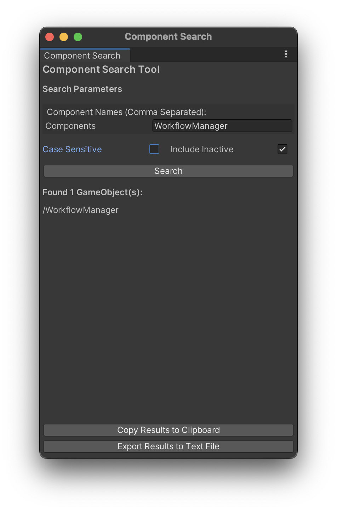

# ComponentSearchTool

**ComponentSearchTool** is a powerful Unity Editor extension that streamlines your workflow by allowing you to swiftly search for components within your scene hierarchy. No more manual hunting through nested GameObjects—find exactly what you need in seconds.

## Features
- **Quick Search:** Enter one or multiple component names to locate GameObjects instantly.
- **Case Sensitivity Toggle:** Refine your search with case-sensitive or insensitive options.
- **Include Inactive Objects:** Choose to search through inactive GameObjects for comprehensive results.
- **Interactive Results:** Click on search results to ping and select the GameObject in the Hierarchy.
- **Export Options:** Copy results to clipboard or export them as a text file for external use.
- **Progress Feedback:** Real-time search progress with the ability to cancel ongoing searches.

## Installation
1. **Download the `.unitypackage`:** [Releases](https://github.com/YourUsername/ComponentSearchTool/releases)
2. **Import into Unity:**
   - Open your Unity project.
   - Navigate to `Assets > Import Package > Custom Package...`.
   - Select the downloaded `.unitypackage` and click **Import**.

## Usage
1. **Open the Tool:**
   - Go to `Tools > Component Search Tool` in the Unity menu bar.
2. **Configure Search Parameters:**
   - Enter the component name(s) you wish to search for (comma-separated for multiple).
   - Toggle **Case Sensitive** and **Include Inactive** as needed.
3. **Execute Search:**
   - Click the **Search** button to initiate the search.
4. **Interact with Results:**
   - View the list of found GameObjects.
   - Click on any result to highlight it in the Hierarchy.
5. **Export Results:**
   - Use the **Copy Results to Clipboard** or **Export Results to Text File** buttons as needed.

## License
This project is licensed under the [MIT License](LICENSE).

## Contributing
Contributions are welcome! Please open an issue or submit a pull request for any enhancements or bug fixes.

---

